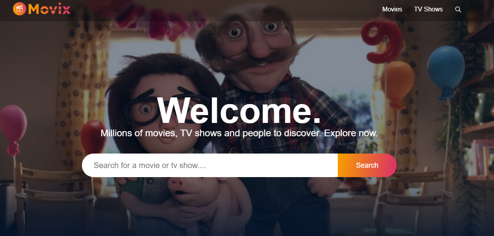
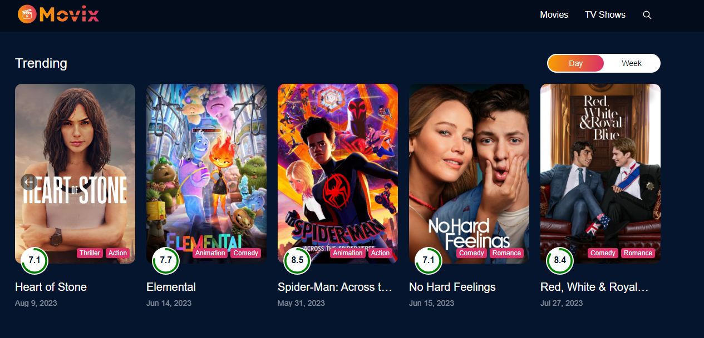

# Movix Web App

Movix is a web application that allows users to search for movies, TV shows, and persons. It utilizes the TMDB API to fetch data and provide users with information about their favorite entertainment.





## Check out the live version: [Movix Live](https://https://movix-erj62rvvs-yk-97-jrs-projects.vercel.app/)

### Features

- Search for movies, TV shows, and persons
- Infinite scrolling for continuous content loading
- Responsive design for a seamless user experience

### Technologies Used

- React
- Redux Toolkit
- Axios
- Day.js
- React Circular Progressbar
- React Icons
- React Infinite Scroll Component
- React Lazy Load Image Component
- React Player
- React Redux
- React Router DOM
- React Select
- Sass
- Tailwind CSS
- Vite

### How to Use

- #### Prerequisites

* Node.js installed

#### Clone and Run Locally

1. Clone the repository:

```bash
git clone git@github.com:Yk-97-Jr/movix.git
cd Movix
```

2. Install dependencies:

```bash
npm i
npm i @reduxjs/toolkit axios dayjs react react-circular-progressbar react-dom react-icons react-infinite-scroll-component react-lazy-load-image-component react-player react-redux react-router-dom react-select sass @types/react @types/react-dom @vitejs/plugin-react autoprefixer eslint eslint-plugin-react eslint-plugin-react-hooks eslint-plugin-react-refresh postcss tailwindcss vite --save

```

3. Start the development server:

```bash
npm run dev
```

4. Open your browser and navigate to [http://localhost:3000](http://localhost:3000) to view the app.

## Contributing

If you'd like to contribute to Movix, please follow these steps:

1. Fork the repository.
2. Create a new branch for your feature or bug fix.
3. Make your changes and submit a pull request.
